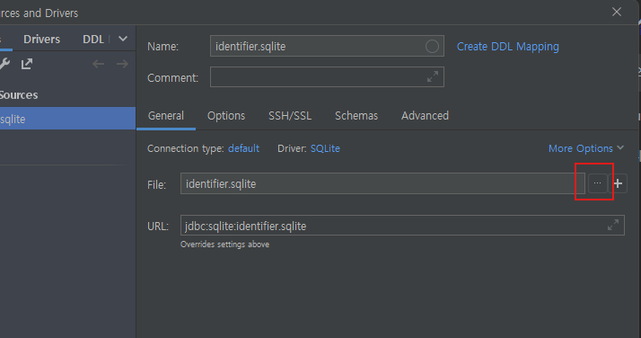
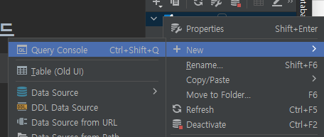

## 데이터베이스 생성 및 데이터 설정 가이드

> 본 프로젝트는 Sqlite 를 사용하였으며 IntelliJ 기준으로 설명합니다.
1. 해당 프로젝트를 빌드합니다. (상단메뉴 Build - Build Project)
2. 프로젝트 폴더에 mydb.db 파일이 생깁니다.
3. 우측 탭에 Database 메뉴를 열고 '+' 버튼을 누릅니다.
4. DataSource 선택 - SQLite 를 선택합니다.
5. 빨간색 네모칸에 있는 "..." 버튼을 클릭합니다.

6. 2번에서 확인했던 프로젝트 폴더 내의 mydb.db 를 설정해줍니다.
7. 우측 Database 탭에 mydb.db 가 추가된 것을 확인합니다.
8. mydb.db 를 우클릭 후 New - Query Console 를 클릭합니다.

9. 프로젝트 폴더 내에 sql_script 폴더로 이동 후 "table.sql" 의 쿼리를 8번에서 열었던
Query Console 에 넣은 뒤 상단 초록색 버튼을 눌러 Execute 합니다.
10. 더미데이터 필요 시 마찬가지로 프로젝트 폴더 내에 sql_script 폴더로 이동 후
테이블이름_dummy.sql 파일들을 9번의 방법으로 Execute 합니다.